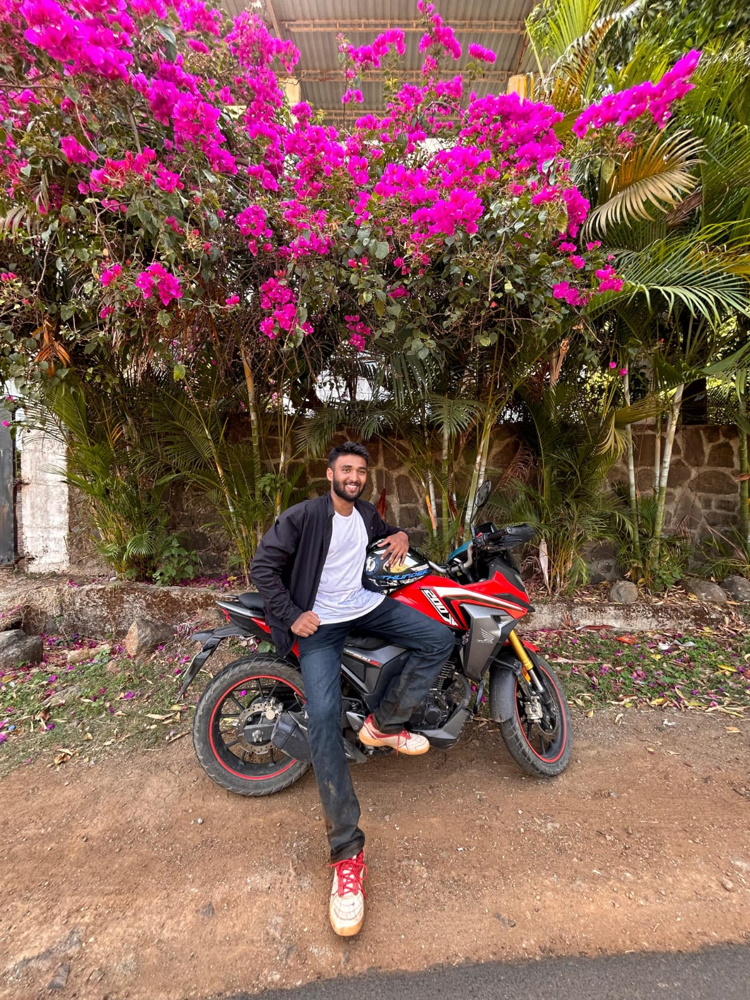

  

---

<h1 align="center">Hey 👋, I'm Nikhil Malvi</h1>
<h3 align="center">An AI & Robotics Enthusiast | Data Scientist | NCC Cadet | Intern at DRDO 🚀</h3>

  

---

### 🚀 About Me  
- 🎯 **Intern at DRDO** | **NCC Cadet** | **Volleyball Team Captain 🏐**  
- 💡 Passionate about **AI, Machine Learning, Robotics, and IoT**  
- 🔭 Currently working on **AI-driven UAVs & Smart IoT Applications**  
- 📚 Always learning **Deep Learning, Embedded Systems, and Data Science**  
- ⚡ Fun fact: **Chai is better than Coffee | Change my mind!**  

---

### 🛠 Tech Stack  

  
  
  
  
  
  
  
  
  
  
  
  
  
  
  

---

### 📊 GitHub Stats  

  
  
  

---

### 🌎 Connect with Me  

  
  
  

---

### 🐍 GitHub Contribution Snake Animation  

  
  <!-- Platane's GitHub Contribution Grid Snake -->
  <picture>
    <source media="(prefers-color-scheme: dark)" srcset="https://raw.githubusercontent.com/platane/platane/output/github-contribution-grid-snake-dark.svg">
    <source media="(prefers-color-scheme: light)" srcset="https://raw.githubusercontent.com/platane/platane/output/github-contribution-grid-snake.svg">
    
  </picture>

---

  

